<div align="center">

# Slide Skill

### Source material in. Polished, editable PowerPoint out.

An SVG-first slide generation toolkit for AI agents and the command line.
Convert PDFs, Markdown, DOCX, or URLs into editable PPTX decks through a
clean, inspectable SVG intermediate.

[English README](README.md) · [中文 README](README.zh-CN.md)

[](pyproject.toml)
[](tests/)
[](pyproject.toml)
[](examples/sample-dark-tech/deck.pptx)
[](#license)

</div>

  ---

  <div align="center">

  ### Live preview — actual PPTX rendered through LibreOffice

  <video src="https://github.com/Yuuqq/slide-skill/raw/master/examples/auto-render/dark-tech/preview.mp4" controls autoplay loop muted playsinline width="720" poster="examples/auto-render/dark-tech/slide_01.png">
    Your browser does not support the video tag — <a href="examples/auto-render/dark-tech/preview.mp4">download the MP4</a> or view the <a href="examples/auto-render/dark-tech/preview.gif">animated GIF</a>.
  </video>

  <sub><b>Real screen recording</b> of the generated <code>.pptx</code>: rendered via LibreOffice → PDF → 1920×1080 PNG frames → H.264 MP4 (16 s, 8 slides @ 2 s each, 348 KB). This is the actual file PowerPoint opens — no SVG approximation. Reproduce locally with <code>slide-skill quickstart examples/sample.md --theme dark-tech</code>: ~2 seconds, no API key, no LLM. Then open the <a href="examples/sample-dark-tech/deck.pptx">.pptx</a> in PowerPoint to edit every shape, text, and gradient natively.</sub>

  </div>

  ---

  ## What it produces

Real example slides — five themes, six layouts. GitHub renders SVG inline,
so what you see below is the actual artifact, not a screenshot.

<table>
<tr>
<td width="50%">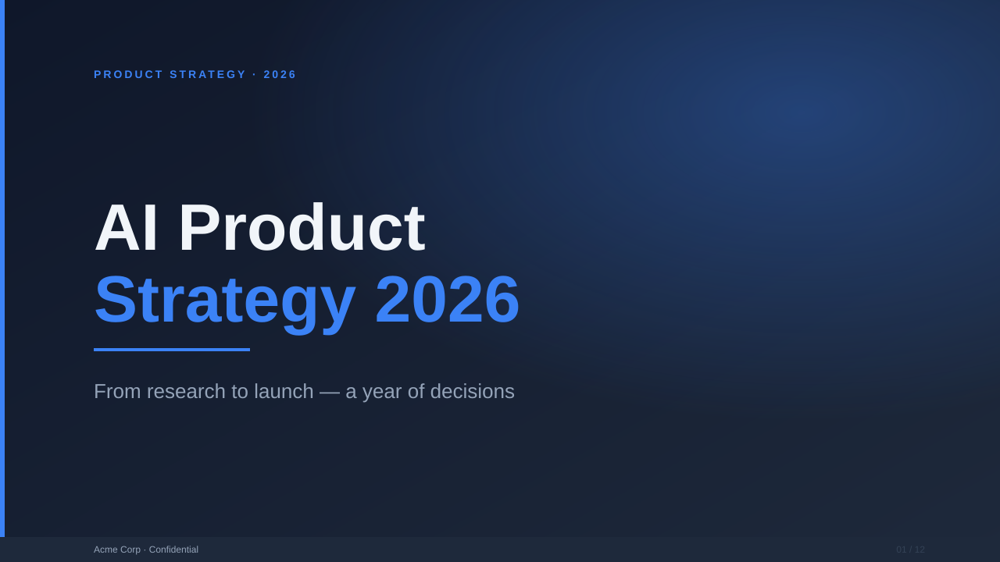</td>
<td width="50%">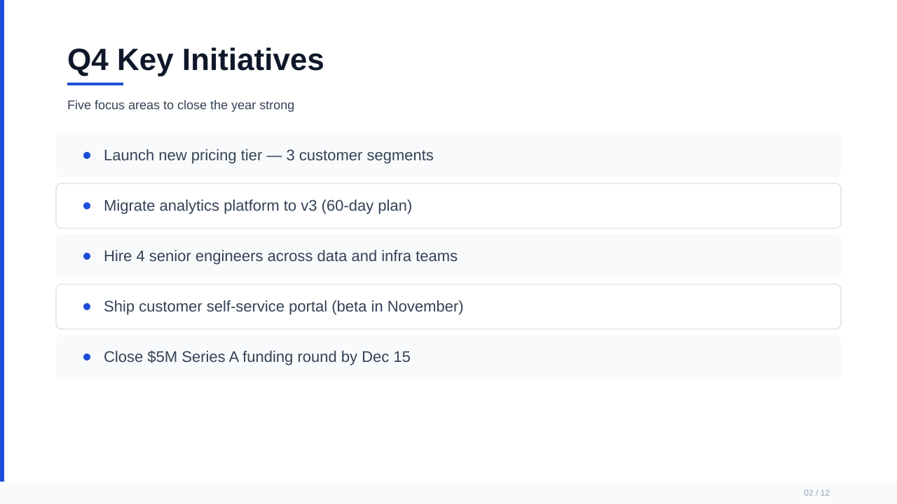</td>
</tr>
<tr>
<td align="center"><sub><b>Cover</b> — <code>dark-tech</code></sub></td>
<td align="center"><sub><b>Bullet list</b> — <code>light-corporate</code></sub></td>
</tr>
<tr>
<td>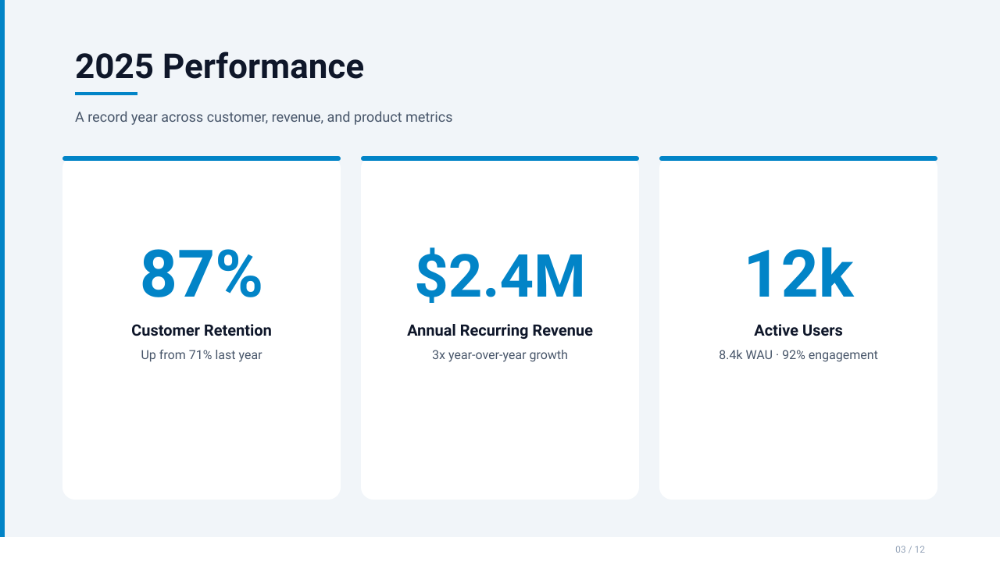</td>
<td>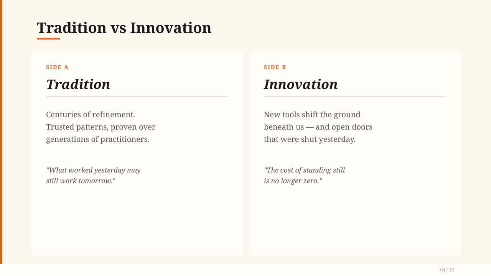</td>
</tr>
<tr>
<td align="center"><sub><b>Metric highlight</b> — <code>data-forward</code></sub></td>
<td align="center"><sub><b>Two-column</b> — <code>warm-editorial</code></sub></td>
</tr>
<tr>
<td>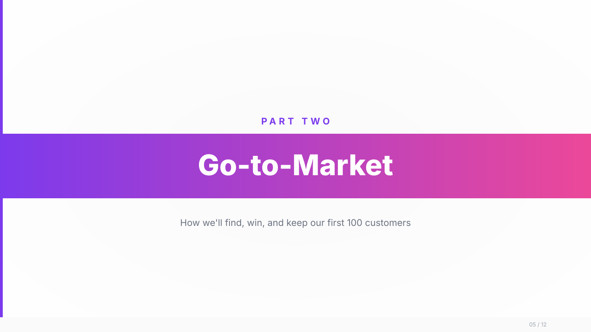</td>
<td>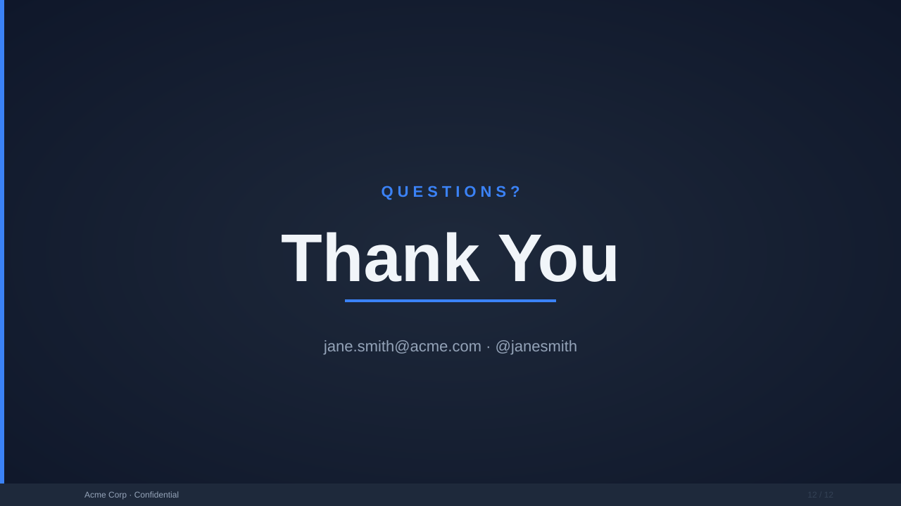</td>
</tr>
<tr>
<td align="center"><sub><b>Section divider</b> — <code>vibrant-startup</code></sub></td>
<td align="center"><sub><b>Closing</b> — <code>dark-tech</code></sub></td>
</tr>
</table>

> Source SVGs and per-file breakdown live in [`examples/`](examples/). Drop them into
> any project's `svg_output/` and run `slide-skill export <project>` to get a PPTX.

---

## Why this exists

PowerPoint is the lingua franca of business and academia, but generating it
from raw text has always been painful. Most tools either spit out a binary
blob you can't inspect, or render slides as bitmaps that no one can edit.

| Common pain | Typical tools | Slide Skill |
|---|---|---|
| Hard to inspect intermediate output | Binary `.pptx` only | Hand-readable SVG you can `cat` and diff |
| LLMs produce a wall of bullets | Fixed prompt → flat list | Layout-aware: cover, metric, two-column, quote… |
| Themes all look the same | One template | 5 themes with full palette + type + layout specs |
| Visual QA is "open and look" | Manual | `check-svg`, `validate-pptx`, machine-readable `QA.md` |
| Gradients become flat colours in PPTX | Bitmap fallback | True `<a:gradFill>` rendered natively (v2.1) |
| AI authoring is one giant prompt | All-in-one | Strategist + Executor multi-role workflow |

---

## Quick start

```bash
pip install -e .

# Source → PPTX in one command
slide-skill quickstart your-notes.md --theme dark-tech

# Open exports/*.pptx in PowerPoint, Keynote, or Google Slides — fully editable.
```

Want more control? Use the multi-step pipeline:

```bash
slide-skill init my-deck --theme light-corporate
slide-skill source-to-md content.pdf -o projects/my-deck/sources/source.md
slide-skill spec projects/my-deck --source projects/my-deck/sources/source.md
slide-skill generate-guide projects/my-deck --source projects/my-deck/sources/source.md
# ...Executor (you or an LLM) writes svg_output/slide_NN.svg guided by design_guide.md
slide-skill check-svg projects/my-deck
slide-skill finalize-svg projects/my-deck
slide-skill export projects/my-deck
```

---

## What's new in v3.0

- 🧠 **Intelligent content planning** — New `content_planner` module understands your source material and automatically picks the best layout per slide. Detects vocabulary lists, dialogues, metrics, process flows, and more from plain markdown.
- 🎓 **Teaching domain** — Specialized layouts for language education: `vocab-card` (1-4 large Chinese words with pinyin + translation), `sentence-example` (with annotations), `dialogue` (A/B conversation bubbles). Auto-sizing Chinese characters (shorter words get larger fonts).
- 📚 **Course domain** — Academic presentation layouts: `learning-objectives`, `key-concept`, `case-study`, `discussion`. Structured for classroom delivery.
- 🏆 **Competition domain** — Pitch deck layouts for student competitions (互联网+, 挑战杯): `team-grid`, `metrics-dashboard`, `timeline`, `comparison-matrix`. Maps to standard competition judging criteria.
- 🌐 **Domain-aware configuration** — Each domain has sensible defaults: teaching caps at 4 items/slide for clarity, competitions enforce time limits, courses balance density. Configure via `ContentConfig(domain="teaching")`.
- 📊 **460 passing tests** — Comprehensive test coverage including 61 new tests for the v3.0 content planning layer.

What landed in **v2.1** and still ships:

- 🎨 **Native PowerPoint gradients** — `<linearGradient>` and `<radialGradient>`
  in your SVG now render as true DrawingML `<a:gradFill>` in the exported
  PPTX (multi-stop, with correct angle math), not a flat mid-point colour.
  Open the `.pptx` in PowerPoint and the gradient is fully editable.

- 🎯 **Polished auto-renderer** — pure-Python templates now produce hero typography, gradient orbs, numbered bullet markers, and accent edges. The default `quickstart` flow looks presentable without any LLM in the loop.

What landed in **v2.0** and still ships:

- **5 design themes** — `dark-tech` · `light-corporate` · `warm-editorial` · `data-forward` · `vibrant-startup`
- **Multi-role workflow** — Strategist plans, Executor authors SVG
- **Per-project design guide** — `design_guide.md` generated from spec lock with full SVG examples
- **Permissive SVG QA** — gradients, opacity, filters, transforms, classes, styles all allowed; only scripts, animations, and DOM event handlers are banned
- **AI SVG authoring prompt** — `slide-skill generate-guide` writes a complete brief for the Executor role
- **170 passing tests** — including end-to-end pipeline runs against two themes

---

## Two ways to use it

  Slide Skill ships two execution paths. Pick based on whether you have an LLM in the loop:

  | | **Auto mode** (default `quickstart`) | **LLM Executor mode** |
  |---|---|---|
  | Setup | `pip install -e .` — that's it | + LLM API key (OpenAI / Claude / local) |
  | Time to first PPTX | ~2 seconds | ~30–90 seconds |
  | Visual ceiling | 6 polished templates with gradients, decorative orbs, numbered bullets, hero typography | Hand-crafted per-slide SVG following `design_guide.md` |
  | Layout selection | Heuristic (cover, bullet, metric, two-column, divider, closing) | LLM picks per slide |
  | Deterministic | ✅ same input → same output | ⚠️ depends on model |
  | Best for | Drafts, internal docs, recurring reports, CI pipelines | Pitch decks, conference talks, design-critical work |
  | Edit afterwards | Yes — fully editable PPTX | Yes — fully editable PPTX |

  **Auto mode samples** (zero API key, real `quickstart` output):

  <table>
  <tr>
  <td width="50%">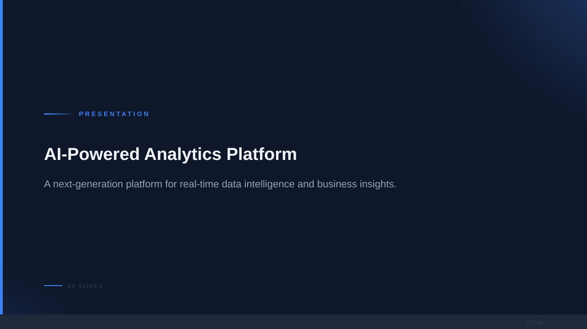</td>
  <td width="50%">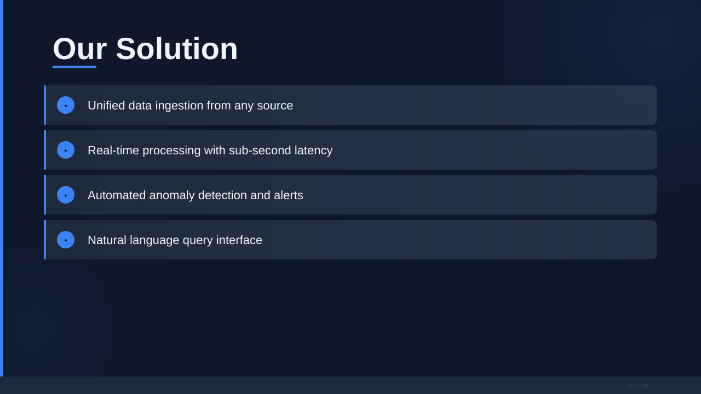</td>
  </tr>
  <tr>
  <td align="center"><sub><b>Auto-rendered cover</b> — <code>dark-tech</code></sub></td>
  <td align="center"><sub><b>Auto-rendered bullet list</b> — <code>dark-tech</code></sub></td>
  </tr>
  <tr>
  <td>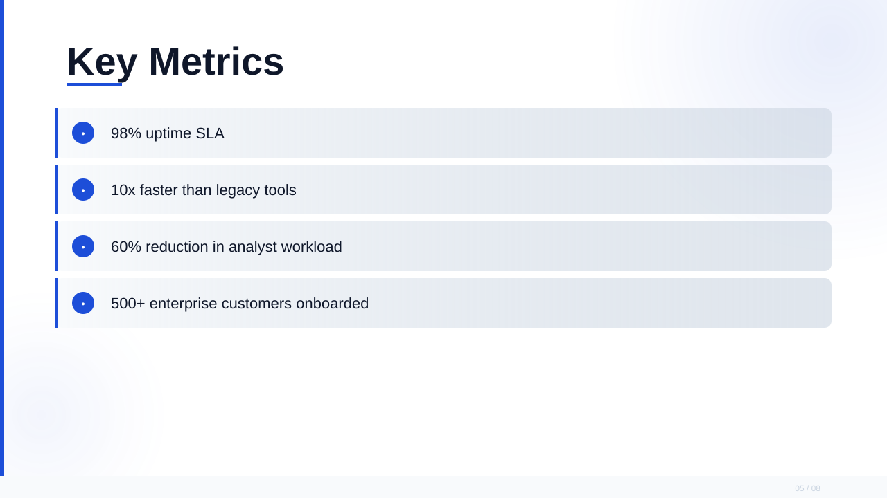</td>
  <td>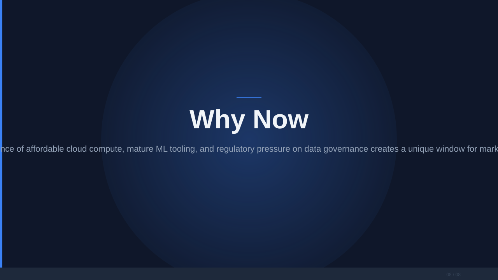</td>
  </tr>
  <tr>
  <td align="center"><sub><b>Auto-rendered metrics</b> — <code>light-corporate</code></sub></td>
  <td align="center"><sub><b>Auto-rendered closing</b> — <code>dark-tech</code></sub></td>
  </tr>
  </table>

  **Per-slide stills** (rasterised PNGs of the same PPTX, for offline viewing):

  <table>
  <tr>
  <td width="25%"></td>
  <td width="25%">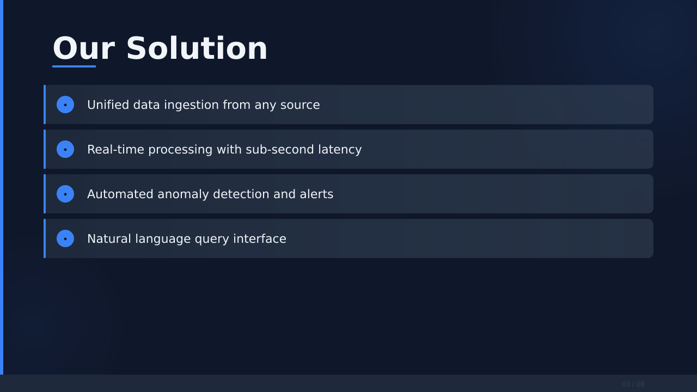</td>
  <td width="25%">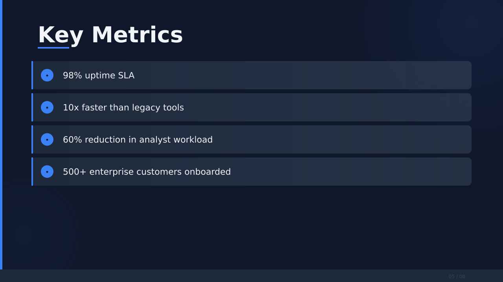</td>
  <td width="25%">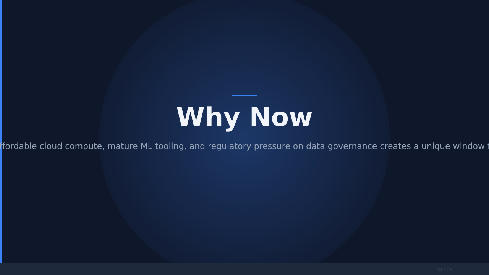</td>
  </tr>
  </table>

  > Compare with the **Pipeline output** section below (auto-mode end-to-end with QA reports),
  > and the **What it produces** showcase above (LLM-Executor reference targets).

  ---

    ## 🌏 中文 / CJK support

    All five themes now ship with a CJK font fallback chain (Microsoft YaHei → PingFang SC → Noto Sans SC → Source Han Sans SC). Chinese, Japanese, Korean input renders natively in PowerPoint, Keynote, Google Slides, and (with `noto-fonts-cjk` installed) LibreOffice.

    A ready-to-run Chinese sample lives at [`examples/sample.zh-CN.md`](examples/sample.zh-CN.md):

    ```bash
    slide-skill quickstart examples/sample.zh-CN.md --theme dark-tech
    ```

    Real recording of the resulting `.pptx` (rendered through LibreOffice → PDF → MP4):

    <div align="center">

    <video src="https://github.com/Yuuqq/slide-skill/raw/master/examples/auto-render/zh-CN/preview-zh.mp4" controls autoplay loop muted playsinline width="720" poster="examples/auto-render/zh-CN/slide_03.png">
      Your browser doesn't support inline video — <a href="examples/auto-render/zh-CN/preview-zh.mp4">download MP4</a> or view <a href="examples/auto-render/zh-CN/preview-zh.gif">animated GIF</a>.
    </video>

    <sub>9-slide Chinese deck rendered with the same dark-tech theme. Same 2-second pipeline, same zero-API-key promise.</sub>

    </div>

    <table>
    <tr>
    <td width="50%"></td>
    <td width="50%">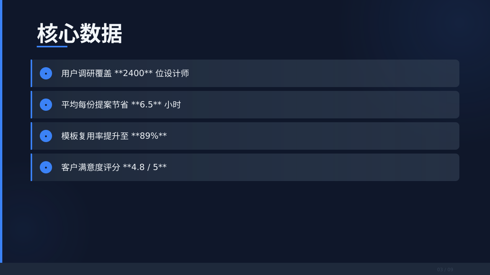</td>
    </tr>
    </table>

    ---

    ## 🤖 Use as an AI agent skill

    `slide-skill` ships with a [`SKILL.md`](SKILL.md) at the repo root, written in the Anthropic Claude Code / Replit Agent skill format. Drop it into any agent that supports the skills convention and the agent will automatically reach for it whenever a user asks for slides, a deck, a presentation, or "做一份 PPT".

    **Claude Code** (`~/.claude/skills/`):

    ```bash
    git clone https://github.com/Yuuqq/slide-skill.git ~/.claude/skills/slide-skill
    ```

    **Replit Agent** (`.local/skills/` in your project):

    ```bash
    git clone https://github.com/Yuuqq/slide-skill.git .local/skills/slide-skill
    ```

    **Cursor / other agents**: copy [`SKILL.md`](SKILL.md) into your rules/skills directory, install the package (`pip install -e tools/slide`), and the agent will know to call `slide-skill quickstart <input.md> --theme <theme>` for any slide-related request.

    The skill file documents:
    - When to activate (English + Chinese trigger phrases)
    - The single command that does 90% of the work
    - How to choose between the 5 themes
    - Markdown authoring conventions (headings, bullets, **bold numbers** for metrics, `### A / ### B` for comparisons)
    - The decision flow the agent should follow

    ---

  ## Pipeline output (real end-to-end run)

The slides above are hand-crafted reference targets. Below is what the
pipeline **actually produced** running `slide-skill quickstart` against
[`examples/sample.md`](examples/sample.md) — an 8-slide
"AI-Powered Analytics Platform" deck — once for each of two themes:

| Theme | SVGs | PPTX | QA report | Visual sample |
|---|---|---|---|---|
| `dark-tech` | [svg_output/](examples/sample-dark-tech/svg_output/) | [deck.pptx](examples/sample-dark-tech/deck.pptx) | [QA.md](examples/sample-dark-tech/QA.md) · [SVG-QA.md](examples/sample-dark-tech/SVG-QA.md) | 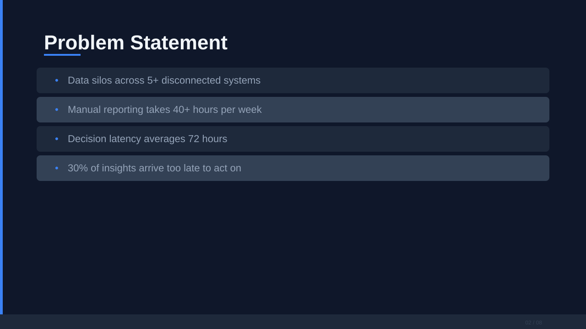 |
| `light-corporate` | [svg_output/](examples/sample-light-corporate/svg_output/) | [deck.pptx](examples/sample-light-corporate/deck.pptx) | [QA.md](examples/sample-light-corporate/QA.md) · [SVG-QA.md](examples/sample-light-corporate/SVG-QA.md) | 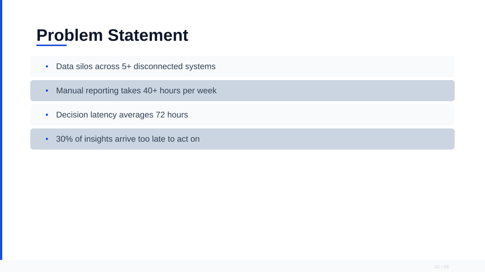 |

Both runs report `status: automated-passed` — PPTX Package ✓, SVG Gate ✓,
Placeholder Scan ✓. See [`examples/RUN-LOG.md`](examples/RUN-LOG.md) for
exact commands, outputs, and a known follow-up (text overflow on
long-paragraph slides).

> The reference decks above showcase the design **ceiling**. The pipeline
> output here shows the current **floor**. Every release should narrow that gap.

---

## How it works

```
┌──────────┐    ┌────────┐    ┌──────────┐    ┌──────────┐
│ Source   │ ─→ │ Spec   │ ─→ │ SVG      │ ─→ │ PPTX     │
│ md/pdf   │    │ JSON   │    │ output/  │    │ deck     │
│ docx/url │    │        │    │ slide_NN │    │ editable │
└──────────┘    └────────┘    └──────────┘    └──────────┘
                    ▲              ▲                ▲
              Strategist      Executor          Export +
              spec +          reads guide,      QA gates:
              generate-guide  writes SVGs       check-svg
                                                validate-pptx
```

The SVG intermediate is the hero. It is a hand-readable file you can:

- Diff in code review
- Tweak in any editor (Inkscape, browser, VSCode)
- Run through automated QA before binary export
- Few-shot into LLM prompts for layout consistency
- Hand to a designer for one-off polish without round-tripping through PPTX

---

## Design themes

| Theme | Background | Accent | Best for |
|---|---|---|---|
| `dark-tech` | `#0F172A` | `#3B82F6` | Engineering, SaaS, research |
| `light-corporate` | `#FFFFFF` | `#1D4ED8` | Business, corporate |
| `warm-editorial` | `#FDF6EE` | `#EA580C` | Humanities, editorial |
| `data-forward` | `#F1F5F9` | `#0284C7` | Analytics, dashboards |
| `vibrant-startup` | `#FFFFFF` | `#7C3AED` | Startups, pitch decks |

```bash
slide-skill themes    # list all themes
slide-skill formats   # list all canvas formats
```

---

## Multi-role workflow

### Strategist role

Prepares all planning artifacts before any SVG is written.

1. Normalize source: `slide-skill source-to-md <file>`
2. Create workspace: `slide-skill init <name> --theme <theme>`
3. Write design artifacts: `slide-skill spec <project> --source <md> --theme <theme>`
4. Write AI prompt: `slide-skill generate-guide <project> --source <md>`

### Executor role

Writes SVG files guided by the planning artifacts.

1. Read `design_guide.md` — palette, typography, layout examples
2. Read `svg_generation_prompt.md` — per-slide content breakdown
3. Write `svg_output/slide_NN.svg` for each slide
4. Validate: `slide-skill check-svg <project>`

---

## SVG authoring rules

**Allowed:** `rect` `circle` `ellipse` `line` `text` `tspan` `image` `path` `polygon`
`polyline` `g` `defs` `linearGradient` `radialGradient` `stop` `filter` `feGaussianBlur`
`feOffset` `feFlood` `feComposite` `feMerge` `feMergeNode` `clipPath` `pattern` `use`

**Banned (hard error):** `script` `foreignObject` `iframe` `animate` `animateTransform`
`set` `animateMotion`

**Banned attributes:** `onclick` `onload` `on*` (any DOM event handler)

**Fully permitted in v2.0+:** `opacity` `fill-opacity` `transform` `class` `style`,
and `fill="url(#local-id)"` gradient references — now rendered natively in PPTX.

---

## Layout templates

| Template | Use when |
|---|---|
| `cover` | Deck title / first slide |
| `section-divider` | Heading with no body text |
| `bullet-list` | 3–7 bullet points |
| `two-column` | Side-by-side comparison |
| `metric-highlight` | 2–4 large numbers / percentages |
| `quote` | A single strong quote |
| `closing` | Thank-you / CTA slide |

Full SVG examples for each template are in the generated `design_guide.md`.

---

## Chrome requirements (every slide)

```xml
<!-- Left accent stripe (required) -->
<g id="chrome-stripe">
  <rect x="0" y="0" width="6" height="720" fill="{accent}" />
</g>

<!-- Footer bar (required) -->
<g id="chrome-footer">
  <rect x="0" y="688" width="1280" height="32" fill="{surface}" />
  <text x="1184" y="708" ...>NN / TT</text>
</g>
```

---

## Speaker notes

Write notes to `<project>/notes/total.md`:

```markdown
## Slide 1
Opening remarks.

## Slide 2
Key insight: market opportunity is $50B.
```

Notes are embedded in the PPTX automatically during export.

---

## Student competition toolkit

```bash
slide-skill competitions                    # list templates
slide-skill init <name> --competition internet-plus
slide-skill rehearse <project>              # timing analysis
slide-skill draft-notes <project>           # generate notes draft
```

Templates: `internet-plus` · `challenge-cup` · `math-modeling` ·
`innovation-training` · `thesis-defense` · `course-presentation`

---

## TTS narration

```bash
# Edge TTS (default — free, offline-friendly)
slide-skill narrate <project> --engine edge-tts --voice zh-CN-XiaoxiaoNeural

# MiMo voice cloning
slide-skill narrate <project> --engine mimo --voice-clone sample.mp3

# MiMo voice design
slide-skill narrate <project> --engine mimo --voice-design "gentle female voice"
```

---

## Development

```bash
# Run the test suite (170 tests, 50 subtests)
pytest tests/ -v

# Lint / type-check helpers (if configured)
python -m slide_skill.cli --help
```

The `skills/slide/` directory contains the agent skill documentation:

- `SKILL.md` — main skill entry point for AI agents
- `guides/intake.md` — source conversion and project setup
- `guides/svg-pipeline.md` — design guide, SVG rules, finalization
- `guides/export.md` — PPTX export and validation
- `guides/editing.md` — template operations
- `guides/qa.md` — QA loop and artifact expectations

---

## License

MIT — see [`LICENSE`](LICENSE) if present, or treat as MIT by default.
